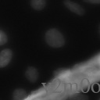
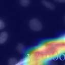

# ImageForensics - *Unofficial* PyTorch Implementation

**Detecting duplication of scientific images with manipulation-invariant image similarity**<br>
M. Cicconet, H. Elliott, D.L. Richmond, D. Wainstock, M. Walsh<br>

Paper: https://arxiv.org/abs/1802.06515<br>
Website: https://hms-idac.github.io/ImageForensics<br>

Dataset being used to create synthetic data is the [Kaggle 2018 Data Science
Bowl](https://data.broadinstitute.org/bbbc/BBBC038/) from the Broad Institute
Bioimage Benchmark Collection. Network architecture has been very slightly
modified from paper (see `model.py`). Synthetic data is created in `dataset.py`
using manipulations defined in `manipulations.py` as well as transforms included
in [torchvision](https://pytorch.org/docs/stable/torchvision/transforms.html).

## Experimental Addition: Grad-CAM

See *why* images are detected as similar using Grad-CAM
(https://arxiv.org/abs/1610.02391). Example:

**Image**


**Manipulated**<br>
Note rotation, text, change of scale and brightness



**Grad-CAM Image**


**Grad-CAM Manipulated**



## Example Detections


## Requirements

 * Tested on Ubuntu 18.04.3 LTS, Python 3.7.5, PyTorch 1.2.0


## Download Data

```shell
make download
```

## Train

```shell
python train.py
```

## Test

View test examples

```shell
python test.py
```

## Example Incorrect Predictions

### Should Detect Same


### Should Detect Different


